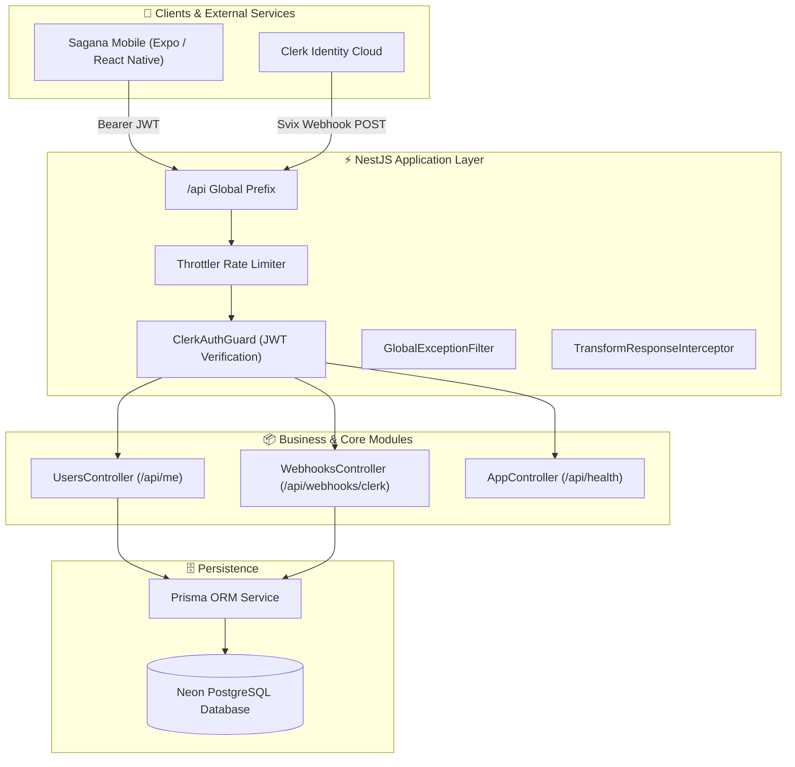

# 🌱 Sagana Backend API

> Robust, high-performance NestJS 11 enterprise backend powering the **Sagana Smart Agriculture & IoT Management Platform**.

[](https://nestjs.com/)
[](https://www.typescriptlang.org/)
[](https://www.prisma.io/)
[](https://neon.tech/)
[](https://clerk.com/)
[](https://vitepress.dev/)

---

## 📖 Table of Contents

- [Overview](#-overview)
- [Key Features](#-key-features)
- [Tech Stack](#-tech-stack)
- [System Architecture](#-system-architecture)
- [Folder Structure](#-folder-structure)
- [Prerequisites](#-prerequisites)
- [Environment Configuration](#-environment-configuration)
- [Quick Start](#-quick-start)
- [Database Management](#-database-management)
- [API Documentation & Swagger](#-api-documentation--swagger)
- [Interactive Documentation Site](#-interactive-documentation-site)
- [Authentication & Mobile Sync](#-authentication--mobile-sync)
- [Deployment (Render)](#-deployment-render)
- [Scripts Reference](#-scripts-reference)

---

## 🌟 Overview

**Sagana Backend** is the central application server for the Sagana agricultural monitoring ecosystem. It handles device telemetry, user profile management, secure authentication delegation, and automated database synchronization between mobile clients and the cloud.

---

## ✨ Key Features

- 🔐 **Delegated Clerk Authentication**: Global `ClerkAuthGuard` validating cryptographic JWT Bearer claims with `@Public()` decorator bypasses.
- 🔄 **Dual User Synchronization**:
  - **Real-Time Webhooks**: Cryptographic Svix signature-verified webhook handler for `user.created`, `user.updated`, and `user.deleted` events.
  - **JIT (Just-In-Time) Auto-Provisioning**: Automatic fallback fetching from Clerk's REST API on first profile query.
- 🛡️ **Schema-Driven Validation**: Type-safe input parsing using `Zod` and `nestjs-zod` v5.
- 📄 **Interactive OpenAPI / Swagger**: Built-in interactive API documentation at `/api/docs` with post-processed DTO cleanup via `cleanupOpenApiDoc`.
- 🗄️ **Serverless-Ready PostgreSQL**: Integrated with Neon Serverless Postgres via Prisma ORM 7.
- 📚 **Comprehensive VitePress Docs**: Interactive markdown documentation with embedded Mermaid architecture diagrams.
- 🛡️ **Rate Limiting & Security**: Throttling via `@nestjs/throttler` and unified exception envelopes with `GlobalExceptionFilter`.

---

## 🛠️ Tech Stack

| Layer | Technology |
| :--- | :--- |
| **Framework** | [NestJS 11](https://nestjs.com/) (Express platform) |
| **Language** | [TypeScript 5.7](https://www.typescriptlang.org/) |
| **Database & ORM** | [Prisma 7](https://www.prisma.io/) + [Neon Serverless PostgreSQL](https://neon.tech/) |
| **Auth & Security** | [Clerk Backend SDK](https://clerk.com/) (`@clerk/backend`, `svix`) |
| **Validation & DTOs** | [Zod 4](https://zod.dev/) + [nestjs-zod 5](https://github.com/BenLorantfy/nestjs-zod) |
| **API Docs** | [Swagger / OpenAPI 3.0](https://swagger.io/) (`@nestjs/swagger`) |
| **Documentation Site** | [VitePress 1.6](https://vitepress.dev/) + `vitepress-plugin-mermaid` |
| **Package Manager** | [pnpm](https://pnpm.io/) |

---

## 📐 System Architecture



---

## 📁 Folder Structure

```
sagana-backend/
├── docs/                   # 📚 VitePress Documentation Site
│   ├── .vitepress/         # Theme & sidebar configurations
│   ├── core-concepts/      # Security, auth lifecycle, responses
│   ├── database/           # Prisma & PostgreSQL schema designs
│   ├── development/        # Dev setup & deployment guides
│   ├── modules/            # Domain module documentation
│   └── overview/           # Architecture diagrams & blueprints
├── prisma/                 # 🗄️ Database Schemas & Migrations
│   ├── generated/          # Auto-generated Zod DTOs
│   ├── schema.prisma       # Database schema definition
│   └── prisma.config.ts    # Prisma configuration
├── src/                    # 🚀 Application Source Code
│   ├── core/               # Cross-cutting concerns
│   │   ├── config/         # Environment schema validation
│   │   ├── decorators/     # @Public(), @CurrentUserId()
│   │   ├── exceptions/     # GlobalExceptionFilter
│   │   ├── guards/         # ClerkAuthGuard
│   │   ├── interceptors/   # TransformResponseInterceptor
│   │   └── logger/         # Structured LoggerService
│   ├── infrastructure/     # Database providers
│   │   └── database/       # PrismaService & DatabaseModule
│   ├── modules/            # Business feature modules
│   │   ├── users/          # Profile retrieval & JIT provisioning
│   │   └── webhooks/       # Svix Clerk webhook listener
│   ├── app.controller.ts   # /api/health endpoint
│   ├── app.module.ts       # Root module configuration
│   └── main.ts             # Application bootstrapper
├── .env.example            # Environment variables template
├── package.json            # Project dependencies & scripts
└── tsconfig.json           # TypeScript configuration
```

---

## ⚡ Prerequisites

- **Node.js**: `v20.x` or higher
- **pnpm**: `v9.x` or higher (`npm install -g pnpm` or `corepack enable pnpm`)
- **Neon PostgreSQL**: Active database instance
- **Clerk Account**: Active application with Secret & Publishable keys

---

## 🔐 Environment Configuration

Create a `.env` file in the root directory by copying [`.env.example`](file:///.env.example):

```bash
cp .env.example .env
```

Refer to [`.env.example`](file:///.env.example) for all required environment variables:
- **`DATABASE_URL`**: Neon PostgreSQL connection string (`?sslmode=verify-full&channel_binding=require`)
- **`CLERK_SECRET_KEY`** & **`CLERK_PUBLISHABLE_KEY`**: Clerk API keys
- **`CLERK_WEBHOOK_SECRET`**: Clerk Svix webhook signing secret (`whsec_...`)
- **`PORT`** & **`API_PREFIX`**: Server port and routing prefix (`api`)

---

## 🚀 Quick Start

### 1. Install Dependencies
```bash
pnpm install
```

### 2. Generate Prisma Client & Zod Schemas
```bash
pnpm prisma generate
```

### 3. Push Database Schema to Neon
```bash
npx prisma db push
```

### 4. Start Development Server
```bash
pnpm run start:dev
```

The API will be available at: **`http://localhost:3000/api`**

---

## 🗄️ Database Management

```bash
# Push schema changes to Neon database (prototyping)
npx prisma db push

# Create and apply migrations (production)
npx prisma migrate dev --name <migration_name>

# Launch interactive Prisma Studio GUI
npx prisma studio
```

---

## 📑 API Documentation & Swagger

When the server is running, explore and test the interactive OpenAPI documentation at:

🔗 **[http://localhost:3000/api/docs](http://localhost:3000/api/docs)**

---

## 📚 Interactive Documentation Site

Run the interactive VitePress architecture guide:

```bash
# Start local docs server (http://localhost:5173)
pnpm run docs:dev

# Build production docs
pnpm run docs:build

# Preview production docs bundle
pnpm run docs:preview
```

---

## 🔄 Authentication & Mobile Sync

The backend uses a **dual-sync model** to guarantee user records in Neon PostgreSQL:

1. **Webhook Sync (`POST /api/webhooks/clerk`)**:
   - In production or with a tunnel (e.g. `ngrok http 3000`), Clerk dispatches `user.created` / `user.updated` events directly to the webhook handler.
2. **JIT (Just-In-Time) Auto-Provisioning**:
   - In local development, when a newly signed-up mobile user hits `GET /api/me`, the backend automatically queries Clerk's API and creates the record in PostgreSQL on the fly if not already present.

---

## ☁️ Deployment (Render)

This repository is pre-configured for one-click deployment on **[Render](https://render.com/)**:

### Web Service Settings:
- **Environment**: `Node`
- **Build Command**: `pnpm install && pnpm build`
- **Start Command**: `pnpm start:prod`
- **Health Check Path**: `/api/health`

### Required Environment Variables on Render:
- `DATABASE_URL`
- `CLERK_SECRET_KEY`
- `CLERK_PUBLISHABLE_KEY`
- `CLERK_WEBHOOK_SECRET`
- `API_PREFIX` = `api`
- `NODE_ENV` = `production`

---

## 📜 Scripts Reference

| Command | Description |
| :--- | :--- |
| `pnpm start` | Starts NestJS server in standard mode |
| `pnpm start:dev` | Starts NestJS server with hot-reload watch mode |
| `pnpm start:prod` | Runs compiled production server (`dist/main.js`) |
| `pnpm build` | Generates Prisma client & compiles TypeScript |
| `pnpm lint` | Runs ESLint and fixes style violations |
| `pnpm format` | Formats codebase using Prettier |
| `pnpm test` | Executes Jest unit test suite |
| `pnpm test:e2e` | Executes end-to-end integration tests |
| `pnpm docs:dev` | Launches VitePress documentation dev server |
| `pnpm docs:build` | Compiles VitePress documentation site |

---

## 📄 License

This project is licensed under the **UNLICENSED** private commercial terms for the Sagana platform.
