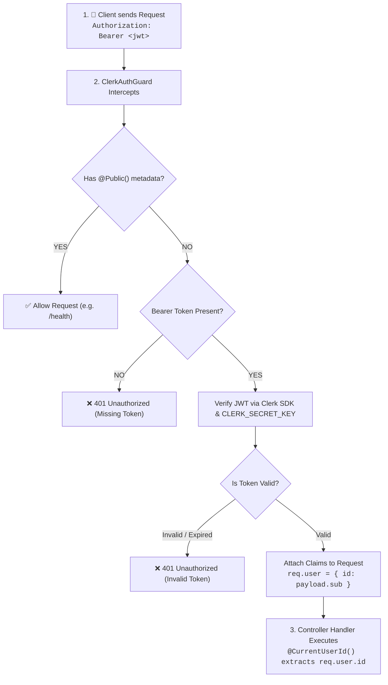

# Authentication & Security Lifecycle

Sagana Backend delegates user identity, authentication, session security, and credential management to **Clerk** via `@clerk/backend`.

---

## 🔒 Global Protection Model

By default, **every route in the backend is guarded and private**. 

The [`ClerkAuthGuard`](../../src/core/guards/clerk-auth.guard.ts) is registered as a global guard in [`AppModule`](../../src/app.module.ts):

```typescript
// app.module.ts
providers: [
  {
    provide: APP_GUARD,
    useClass: ClerkAuthGuard,
  },
]
```

---

## 🧭 Authentication Lifecycle Flow



---

## 🏷️ Custom Decorators

### 1. `@Public()`
Bypasses the global `ClerkAuthGuard`. Use this for health checks, public info, and webhook endpoints.

```typescript
import { Controller, Get } from '@nestjs/common';
import { Public } from 'src/core/decorators/public.decorator';

@Controller('health')
export class HealthController {
  @Public()
  @Get()
  checkHealth() {
    return { status: 'healthy' };
  }
}
```

---

### 2. `@CurrentUserId()`
Injects the authenticated user's Clerk ID (`user_2bX...`) directly into the controller handler.

```typescript
import { Controller, Get } from '@nestjs/common';
import { CurrentUserId } from 'src/core/decorators/current-user.decorator';

@Controller('me')
export class UsersController {
  @Get()
  getProfile(@CurrentUserId() userId: string) {
    return this.usersService.getProfile(userId);
  }
}
```
