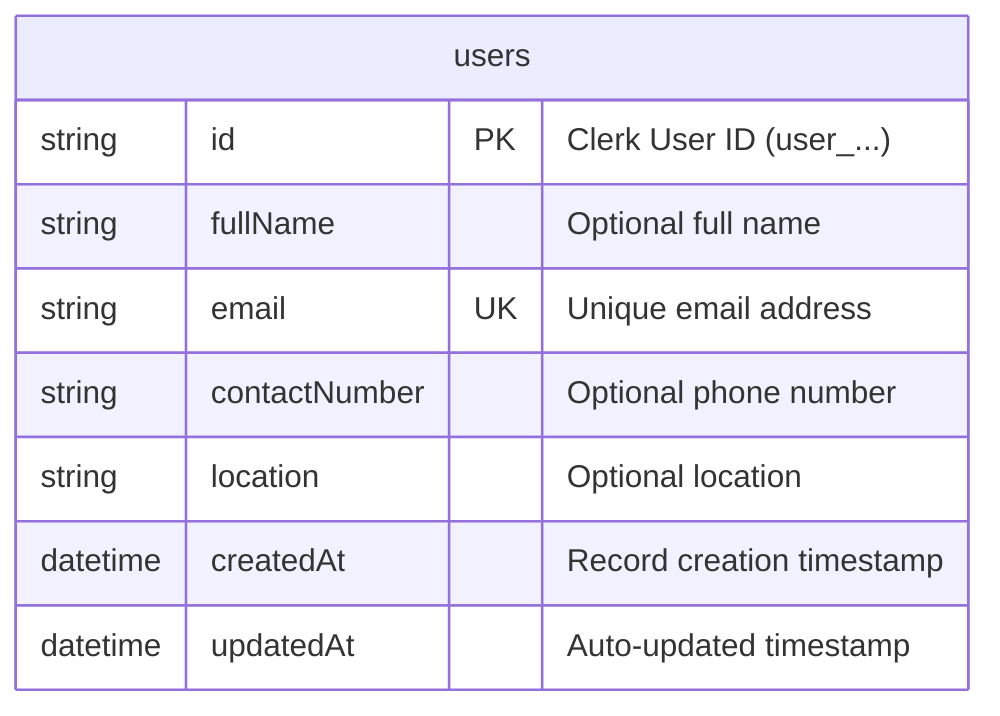

# PostgreSQL & Prisma 7 Schema

Sagana Backend uses **PostgreSQL** hosted on Neon, managed with **Prisma 7** and driver adapters for high connection efficiency.

---

## 🗄️ Connection Pooling with `@prisma/adapter-pg`

Rather than relying purely on Prisma's internal binary engine for connections, the backend utilizes `pg.Pool` coupled with `@prisma/adapter-pg` in [`PrismaService`](../../src/infrastructure/database/prisma.service.ts):

```typescript
@Injectable()
export class PrismaService extends PrismaClient implements OnModuleInit, OnModuleDestroy {
  constructor() {
    const pool = new Pool({ connectionString: process.env.DATABASE_URL });
    const adapter = new PrismaPg(pool);
    super({ adapter });
  }

  async onModuleInit() {
    await this.$connect();
  }

  async onModuleDestroy() {
    await this.$disconnect();
  }
}
```

---

## 📐 Database Models & Entity Relationship



### `User` Model (`users` table)

```prisma
model User {
  id            String   @id /// Clerk User ID (user_2bX...)
  fullName      String?
  email         String   @unique
  contactNumber String?
  location      String?

  createdAt     DateTime @default(now())
  updatedAt     DateTime @updatedAt

  @@map("users")
}
```

### Fields Description

| Field | Type | Attributes | Description |
| :--- | :--- | :--- | :--- |
| `id` | `String` | `@id` | The unique ID assigned by Clerk (`user_...`). Serves as primary key. |
| `fullName` | `String?` | Optional | User's full name synced from Clerk or updated via `/me`. |
| `email` | `String` | `@unique` | Primary email address. |
| `contactNumber` | `String?` | Optional | Phone number synced or updated. |
| `location` | `String?` | Optional | User's geographical location or city. |
| `createdAt` | `DateTime` | `@default(now())` | Record creation timestamp. |
| `updatedAt` | `DateTime` | `@updatedAt` | Automatically updated timestamp. |

---

## 🛠️ Prisma Management Commands

```bash
# Push schema changes directly to development database
pnpm prisma db push

# Generate Prisma Client and Zod types
pnpm prisma generate

# Open interactive Prisma Studio in browser
pnpm prisma studio
```
