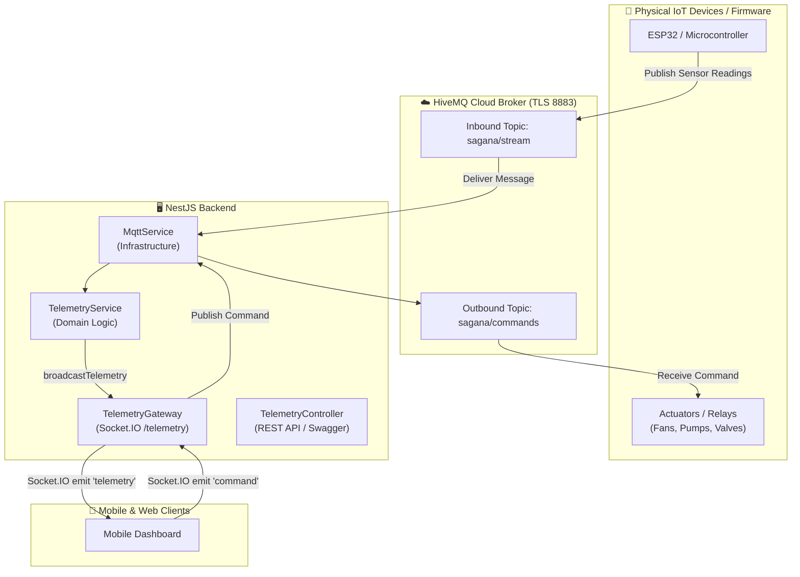

# Telemetry & MQTT Integration (HiveMQ)

The **Telemetry & MQTT Module** manages real-time IoT device communication, live telemetry streaming, and downlink device actuation through a managed **HiveMQ Cloud** MQTT broker.

---

## 🏗️ Architecture & Data Flow



---

## 📡 MQTT Topic Specification

| Topic Pattern | Direction | QoS | Purpose |
| :--- | :--- | :---: | :--- |
| **`sagana/stream`** | Firmware → Broker → Backend | `1` | Live telemetry stream (sensor readings, temperature, humidity, water level). |
| **`sagana/commands`** | Backend → Broker → Firmware | `1` | Downlink control triggers (e.g. `RELAY_ON`, `{"state": 1}`). |

---

## 🚦 Understanding Quality of Service (QoS)

**QoS (Quality of Service)** is the delivery guarantee contract between the sender (client/device), the MQTT broker (HiveMQ), and the subscriber (backend).

### QoS Levels Comparison

| QoS Level | Guarantee | Delivery Mechanism | Lost Messages? | Duplicates? | Best For |
| :---: | :--- | :--- | :---: | :---: | :--- |
| **`0`** | **At most once**<br/>*(Fire & forget)* | Message sent once with no acknowledgment receipt. | ⚠️ Possible | ❌ Never | High-speed, non-critical metrics (e.g., live GPS streams). |
| **`1`** | **At least once**<br/>*(Recommended ⭐)* | Sender retries until it receives a `PUBACK` receipt from the broker. | ❌ Never | ⚠️ Possible | **Compost sensor readings & device telemetry**. |
| **`2`** | **Exactly once**<br/>*(Handshake)* | 4-step confirmation handshake (`PUBREC`, `PUBREL`, `PUBCOMP`). | ❌ Never | ❌ Never | Financial transactions or irreversible hardware triggers. |

::: tip 💡 Why Sagana Uses QoS 1
Sagana Backend defaults to **QoS 1** across all MQTT topics. This guarantees that critical hardware commands and sensor readings are never lost during temporary WiFi disconnects or network blips.
:::

---

## 📍 REST API Endpoints

All telemetry endpoints are documented with Swagger and grouped under **`Telemetry & IoT`**.

| Method | Endpoint | Protected | Description |
| :--- | :--- | :---: | :--- |
| **`POST`** | `/api/telemetry/devices/:deviceId/command` | 🔒 Yes | Dispatch an MQTT action down to a physical hardware device. |

---

## ⚡ Socket.IO Real-Time Gateway (`/telemetry`)

The backend exposes a real-time **Socket.IO WebSocket Gateway** mounted on the **`/telemetry`** namespace to stream live telemetry and receive commands from mobile and web applications.

### 1. Gateway Event Specification

#### 📤 Server → Client (Broadcast Events)

| Event Name | Payload Structure | Description |
| :--- | :--- | :--- |
| **`telemetry`** | `TelemetryData \| object \| string` | Real-time payload received from HiveMQ topic `sagana/stream`. |

#### 📥 Client → Server (Inbound Events)

| Event Name | Request Payload | Action |
| :--- | :--- | :--- |
| **`command`** | `string \| object` | Dispatches custom control message directly to HiveMQ topic `sagana/commands`. |

---

## 🧪 Testing with HiveMQ Cloud Web Client

You can test two-way communication without physical hardware in seconds:

1. Open your **HiveMQ Cloud Console** → Go to your **Cluster** → Open the **Web Client** tab.
2. Connect with your credentials (`likha` / `likha2026`).
3. Under **Topic Subscriptions**:
   * Add `sagana/commands` (to observe incoming commands from the mobile app)
4. Under **Send Message**:
   * Topic: `sagana/stream`
   * Payload:
     ```json
     { "temperature": 28.5, "humidity": 65 }
     ```
   * Click **Publish**. The mobile dashboard immediately renders the live readings!
