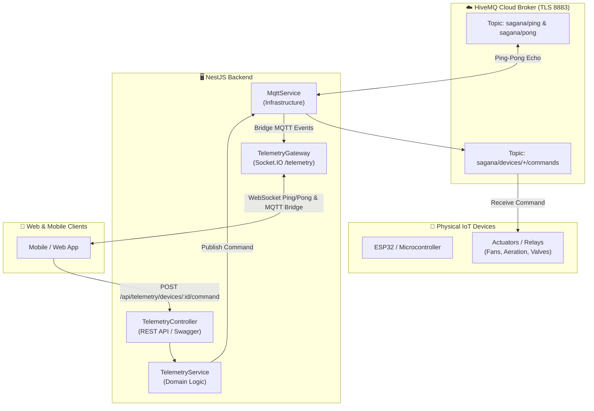

# Telemetry & MQTT Integration (HiveMQ)

The **Telemetry & MQTT Module** manages real-time IoT device communication, protocol diagnostics, and downlink device control through a managed **HiveMQ Cloud** MQTT broker.

---

## 🏗️ Architecture & Data Flow

---

## 📡 MQTT Topic Specification

| Topic Pattern | Direction | QoS | Purpose |
| :--- | :--- | :---: | :--- |
| **`sagana/ping`** | Client → Broker → Backend | `1` | Test connectivity. Backend receives ping and replies to `sagana/pong`. |
| **`sagana/pong`** | Backend → Broker → Client | `1` | Response echo containing payload and server timestamp. |
| **`sagana/devices/{deviceId}/commands`** | Backend → ESP32 | `1` | Downlink control actions (e.g., toggle fan, recalibrate). |

---

## 🚦 Understanding Quality of Service (QoS)

**QoS (Quality of Service)** is the delivery guarantee contract between the sender (client/device), the MQTT broker (HiveMQ), and the subscriber (backend).

### QoS Levels Comparison

| QoS Level | Guarantee | Delivery Mechanism | Lost Messages? | Duplicates? | Best For |
| :---: | :--- | :--- | :---: | :---: | :--- |
| **`0`** | **At most once** *(Fire & forget)* | Message sent once with no acknowledgment receipt. | ⚠️ Possible | ❌ Never | High-speed, non-critical metrics (e.g., live GPS streams). |
| **`1`** | **At least once** *(Recommended ⭐)* | Sender retries until it receives a `PUBACK` receipt from the broker. | ❌ Never | ⚠️ Possible | **Compost sensor readings & device telemetry**. |
| **`2`** | **Exactly once** *(Handshake)* | 4-step confirmation handshake (`PUBREC`, `PUBREL`, `PUBCOMP`). | ❌ Never | ❌ Never | Financial transactions or irreversible hardware triggers. |

::: tip 💡 Why Sagana Uses QoS 1
Sagana Backend defaults to **QoS 1** across all MQTT topics. This guarantees that critical hardware commands and status pings are never lost during temporary WiFi disconnects or network blips.
:::

---

## 📍 REST API Endpoints

All telemetry endpoints are documented with Swagger and grouped under **`Telemetry & IoT`**.

| Method | Endpoint | Protected | Description |
| :--- | :--- | :---: | :--- |
| **`POST`** | `/api/telemetry/devices/:deviceId/command` | 🔒 Yes | Dispatch an MQTT action down to a physical hardware device. |

---

## ⚡ Socket.IO Real-Time Gateway (`/telemetry`)

The backend exposes a real-time **Socket.IO WebSocket Gateway** mounted on the **`/telemetry`** namespace to stream diagnostic events and test latency directly with web and mobile apps.

### 1. Gateway Event Specification

#### 📤 Server → Client (Broadcast Events)

| Event Name | Payload Structure | Description |
| :--- | :--- | :--- |
| **`pong`** | `{ status: 'ok', source: 'socket.io-server', received, timestamp }` | Sent directly in response to mobile `ping`. |
| **`mqtt:ping`** | `{ topic: "sagana/ping", message, timestamp }` | Broadcasted when a test ping is received from HiveMQ. |
| **`mqtt:pong`** | `{ topic: "sagana/pong", message, timestamp }` | Broadcasted when backend publishes a pong reply. |

#### 📥 Client → Server (Inbound Events)

| Event Name | Request Payload | Response Event | Purpose |
| :--- | :--- | :--- | :--- |
| **`ping`** | `{ text: string }` | **`pong`** | Healthcheck and latency measurement between mobile client and backend. |

---

## 🧪 Testing with HiveMQ Cloud Web Client

You can test two-way communication without physical hardware in seconds:

1. Open your **HiveMQ Cloud Console** → Go to your **Cluster** → Open the **Web Client** tab.
2. Connect with your credentials (`likha` / `likha2026`).
3. Under **Topic Subscriptions**:
   * Add `sagana/pong` (to see ping-pong replies)
   * Add `sagana/devices/+/commands` (to see outgoing commands)
4. Under **Send Message**:
   * **Ping-Pong Test:** Publish any string to `sagana/ping`. You will immediately receive `{ "status": "ok", "received": "...", "timestamp": "..." }` on `sagana/pong` and over Socket.IO on the mobile dashboard.
