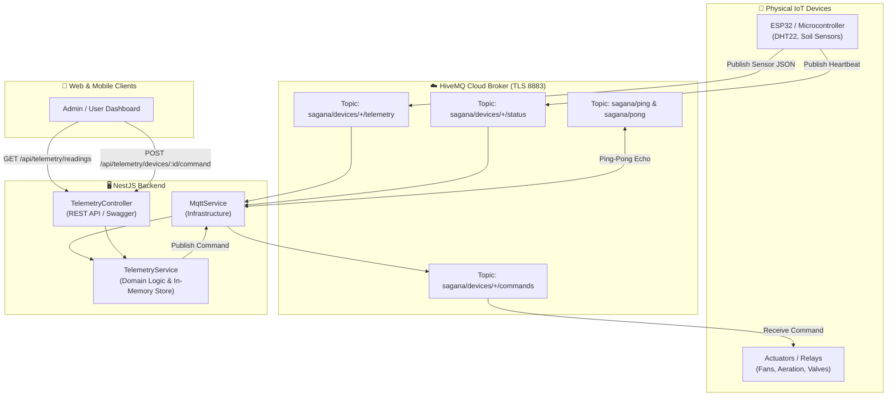

# Telemetry & MQTT Integration (HiveMQ)

The **Telemetry & MQTT Module** manages real-time IoT device communication, sensor data ingestion, and downlink device control through a managed **HiveMQ Cloud** MQTT broker.

---

## 🏗️ Architecture & Data Flow



---

## 📡 MQTT Topic Specification

| Topic Pattern | Direction | QoS | Purpose |
| :--- | :--- | :---: | :--- |
| **`sagana/ping`** | Client → Broker → Backend | `1` | Test connectivity. Backend receives ping and replies to `sagana/pong`. |
| **`sagana/pong`** | Backend → Broker → Client | `1` | Response echo containing payload and server timestamp. |
| **`sagana/devices/{deviceId}/telemetry`** | ESP32 → Backend | `1` | Sensor readings stream (temperature, moisture, humidity). |
| **`sagana/devices/{deviceId}/status`** | ESP32 → Backend | `1` | Device heartbeat, operational status (`online`, `idle`, `error`). |
| **`sagana/devices/{deviceId}/commands`** | Backend → ESP32 | `1` | Downlink control actions (e.g., turn on fan, recalibrate). |

---

## 🚦 Understanding Quality of Service (QoS)

**QoS (Quality of Service)** is the delivery guarantee contract between the sender (client/device), the MQTT broker (HiveMQ), and the subscriber (backend).

### QoS Levels Comparison

| QoS Level | Guarantee | Delivery Mechanism | Lost Messages? | Duplicates? | Best For |
| :---: | :--- | :--- | :---: | :---: | :--- |
| **`0`** | **At most once**<br/>*(Fire & forget)* | Message sent once with no acknowledgment receipt. | ⚠️ Possible | ❌ Never | High-speed, non-critical metrics (e.g., live GPS streams). |
| **`1`** | **At least once**<br/>*(Recommended ⭐)* | Sender retries until it receives a `PUBACK` receipt from the broker. | ❌ Never | ⚠️ Possible | **Compost sensor readings & device telemetry**. |
| **`2`** | **Exactly once**<br/>*(Handshake)* | 4-step confirmation handshake (`PUBREC`, `PUBREL`, `PUBCOMP`). | ❌ Never | ❌ Never | Financial transactions or irreversible hardware triggers. |

::: tip 💡 Why Sagana Uses QoS 1
Sagana Backend defaults to **QoS 1** across all telemetry and command topics. This guarantees that critical compost telemetry (temperature spikes, aeration states, and moisture thresholds) is never lost during temporary WiFi disconnects or network blips.
:::

---

## 📦 Payload Formats

### 1. Sensor Telemetry Payload
Published by the device to `sagana/devices/<DEVICE_ID>/telemetry`:

```json
{
  "sensorId": "sensor-temp-01",
  "value": 54.8,
  "unit": "°C",
  "batchId": "cm123456789",
  "timestamp": "2026-08-28T14:30:00.000Z"
}
```

* `sensorId` *(string, required)*: Unique identifier of the physical sensor.
* `value` *(number, required)*: Measured float value.
* `unit` *(string, optional)*: Measurement unit (`°C`, `%`, `pH`, `ppm`).
* `batchId` *(string, optional)*: Associated compost batch ID (if assigned).
* `timestamp` *(ISO date string, optional)*: Sensor measurement timestamp.

### 2. Device Status Payload
Published by the device to `sagana/devices/<DEVICE_ID>/status`:

```json
{
  "status": "online",
  "processingStage": "thermophilic"
}
```

### 3. Downlink Command Payload
Published by the backend to `sagana/devices/<DEVICE_ID>/commands`:

```json
{
  "action": "toggle_aeration_fan",
  "payload": {
    "speed": 80,
    "durationMinutes": 15
  }
}
```

---

## 📍 REST API Endpoints

All telemetry endpoints are documented with Swagger and grouped under **`Telemetry & IoT`**.

| Method | Endpoint | Protected | Description |
| :--- | :--- | :---: | :--- |
| **`GET`** | `/api/telemetry/readings` | 🔒 Yes | Query historical/buffered telemetry with optional filters (`batchId`, `sensorId`, `limit`). |
| **`GET`** | `/api/telemetry/devices/:deviceId/latest` | 🔒 Yes | Get the latest sensor values for a specific device. |
| **`POST`** | `/api/telemetry/devices/:deviceId/command` | 🔒 Yes | Dispatch an MQTT action down to a physical hardware device. |

---

## 🧪 Testing with HiveMQ Cloud Web Client

You can test two-way communication without physical hardware in seconds:

1. Open your **HiveMQ Cloud Console** → Go to your **Cluster** → Open the **Web Client** tab.
2. Connect with your credentials (`likha` / `likha2026`).
3. Under **Topic Subscriptions**:
   * Add `sagana/pong` (to see ping-pong replies)
   * Add `sagana/devices/+/commands` (to see outgoing commands)
4. Under **Send Message**:
   * **Ping-Pong Test:** Publish any string to `sagana/ping`. You will immediately receive `{ "status": "ok", "received": "...", "timestamp": "..." }` on `sagana/pong`.
   * **Telemetry Test:** Publish JSON to `sagana/devices/esp32_01/telemetry`:
     ```json
     { "sensorId": "temp_01", "value": 52.4, "unit": "°C" }
     ```
     Backend logs will confirm reception and populate the telemetry query endpoint.

---

## 🔌 ESP32 / Arduino Microcontroller Example

Below is a complete, minimal C++ example using `PubSubClient` and `WiFiClientSecure` for ESP32:

```cpp
#include <WiFi.h>
#include <WiFiClientSecure.h>
#include <PubSubClient.h>

const char* ssid        = "YOUR_WIFI_SSID";
const char* password    = "YOUR_WIFI_PASSWORD";

const char* mqtt_server = "72ce69a1924d47728757a99c70a2ba26.s1.eu.hivemq.cloud";
const int   mqtt_port   = 8883;
const char* mqtt_user   = "likha";
const char* mqtt_pass   = "likha2026";
const char* device_id   = "esp32_bin_01";

WiFiClientSecure espClient;
PubSubClient client(espClient);

void callback(char* topic, byte* payload, unsigned int length) {
  String message;
  for (int i = 0; i < length; i++) message += (char)payload[i];
  Serial.printf("Command received on [%s]: %s\n", topic, message.c_str());
  // Process hardware control actions (e.g. GPIO relays)
}

void setup() {
  Serial.begin(115200);
  WiFi.begin(ssid, password);
  while (WiFi.status() != WL_CONNECTED) delay(500);

  espClient.setInsecure(); // Enable TLS connection
  client.setServer(mqtt_server, mqtt_port);
  client.setCallback(callback);
}

void loop() {
  if (!client.connected()) {
    if (client.connect(device_id, mqtt_user, mqtt_pass)) {
      client.subscribe("sagana/devices/esp32_bin_01/commands");
    }
  }
  client.loop();

  // Stream sensor data every 10 seconds
  static unsigned long lastTime = 0;
  if (millis() - lastTime > 10000) {
    lastTime = millis();
    float temperature = 55.4; // Replace with sensor read
    String payload = "{\"sensorId\":\"temp_01\",\"value\":" + String(temperature) + ",\"unit\":\"°C\"}";
    client.publish("sagana/devices/esp32_bin_01/telemetry", payload.c_str());
  }
}
```
