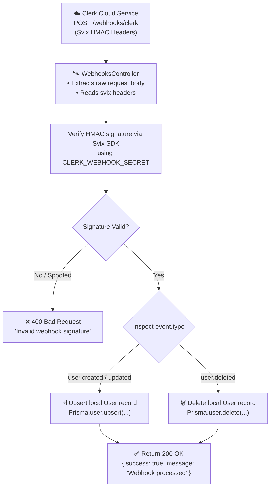

# Clerk Webhook Synchronization

The **Webhooks Module** listens for real-time user lifecycle events dispatched from Clerk to synchronize the local PostgreSQL database.

---

## 🛰️ Webhook Lifecycle Flow



---

## 🔒 Cryptographic Signature Verification

Clerk signs all webhook payloads using **Svix**. To verify that a webhook request actually originated from Clerk:

1. **Raw Body Retention:**
   NestJS is configured with `rawBody: true` in [`main.ts`](../../src/main.ts) so the unparsed byte payload can be passed directly to Svix.
2. **Required Headers:**
   * `svix-id`: Unique message identifier.
   * `svix-timestamp`: Unix timestamp of the message creation.
   * `svix-signature`: HMAC-SHA256 signature calculated with your `CLERK_WEBHOOK_SECRET`.

---

## 🔄 Supported Events

### 1. `user.created` / `user.updated`
Extracts the primary email, combined first/last name, and phone number, then performs an **upsert** to guarantee idempotency:

```typescript
await this.prisma.user.upsert({
  where: { id },
  update: { fullName, email, contactNumber },
  create: { id, fullName, email, contactNumber, location: null },
});
```

### 2. `user.deleted`
Deletes the corresponding user record in the local database:

```typescript
await this.prisma.user.delete({ where: { id } }).catch(() => {});
```
