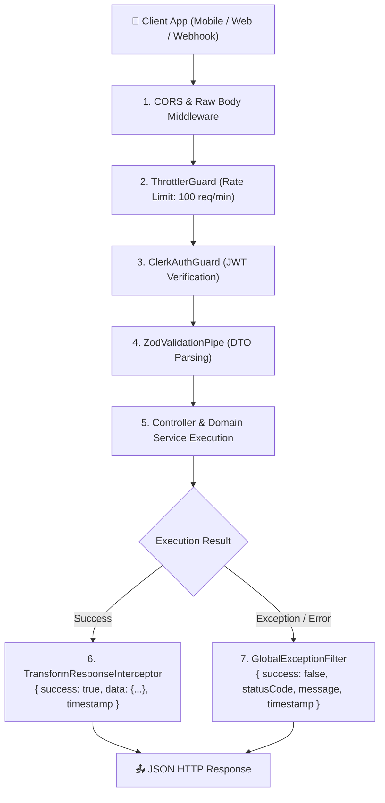

# System Architecture

Sagana Backend is structured as a modular, type-safe API server adhering to clean-architecture principles within the **NestJS** framework ecosystem.

---

## 🏗️ High-Level Request Pipeline

Every incoming HTTP request travels through a unified pipeline of guards, interceptors, and exception filters before and after reaching the controller handler:

---

## 🧩 Technology Stack Rationale

| Layer / Technology | Choice | Why This Choice? |
| :--- | :--- | :--- |
| **Framework** | **NestJS 11 (Express)** | Structured, dependency-injected enterprise TypeScript framework ensuring scalable modular boundaries. |
| **IoT Message Broker** | **HiveMQ Cloud (MQTT / TLS)** | Managed MQTT broker handling bi-directional pub/sub streams from ESP32/microcontroller nodes with TLS encryption. |
| **ORM & Database** | **Prisma 7 + PostgreSQL** | Type-safe query building, instant schema migrations, and native driver pooling via `@prisma/adapter-pg`. |
| **Authentication** | **Clerk (`@clerk/backend`)** | Offloads user credentials, session security, OAuth, and multi-factor auth while keeping internal user profiles in sync. |
| **Schema Validation** | **Zod v4 + `nestjs-zod`** | Single source of truth for runtime validation and static TypeScript types across DTOs and environment variables. |
| **API Documentation** | **Swagger / OpenAPI** | Automated contract generation with DTO metadata and Bearer authorization support. |
| **Testing Client** | **Bruno** | Lightweight, Git-committed REST collections for immediate team testing without account logins. |

---

## 🔄 Separation of Layers

1. **Core Layer (`src/core/`)**:
   Contains cross-cutting concerns that apply globally across all modules (authentication guards, logging services, response interceptors, global exception filters, and env validation).
2. **Infrastructure Layer (`src/infrastructure/`)**:
   Encapsulates external database connections and third-party driver initialization:
   * `database/` — Prisma database client and PostgreSQL connection pool.
   * `mqtt/` — HiveMQ Cloud TLS connection, automatic reconnects, and message dispatching.
3. **Feature Modules (`src/modules/`)**:
   Encapsulates domain-specific business logic (`users`, `webhooks`, `telemetry`). Each module owns its own controllers, services, and DTO definitions.
